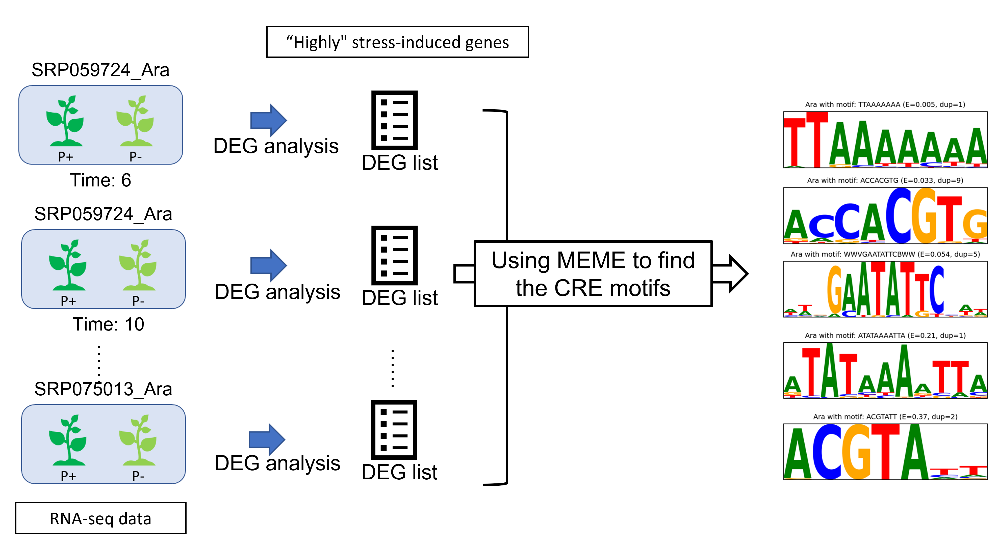
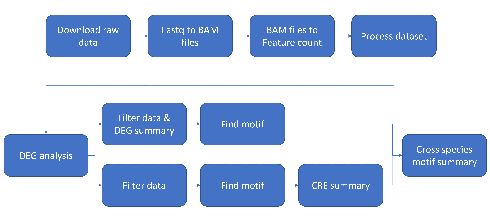

# CREs finding
This covers the process from downloading raw data and processing it, to differential expression analysis (DEG analysis), and finally identifying the corresponding cis-regulatory elements (CREs) using STREME.

📄 [Download the full workflow (PDF)](docs/slides.pdf)

## Abstract
 

## Workflow Overview 
 